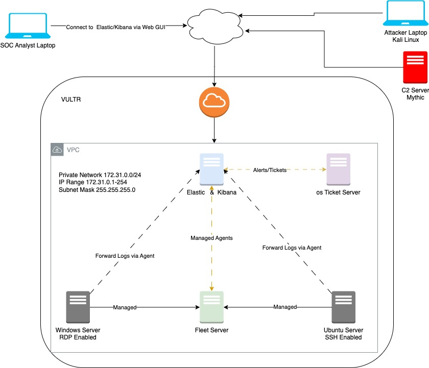

# 🌐 SOC Analyst Design Architecture

This repository outlines the architecture for building and deploying servers tailored to a Security Operations Center (SOC) analyst's needs...

This brranch outlines the architecture for building and deploying servers tailored to a **Security Operations Center (SOC) analyst's** needs using **VULTR cloud provider**. The goal of this challenge is to design, implement, and connect six servers to create a secure and monitored environment for analyzing threats, tracking logs, and managing security operations.

## 🛡️ Overview

The architecture includes six critical servers for SOC operations:

- **Elastic & Kibana**: Centralized logging and real-time monitoring for threat analysis.
- **Windows Server (RDP enabled)**: A remote desktop system for managing and investigating Windows environments.
- **Ubuntu Server (SSH enabled)**: A secure server for managing logs and monitoring network activities via SSH.
- **Fleet Server**: Manages and deploys Elastic agents across other servers to monitor security data.
- **OS Ticket Server**: Tracks incidents and manages remediation workflows.
- **C2 Server**: Simulates command and control activities for training and real-time incident response testing.

---

## 🌩️ Cloud Platform & Tools
- **Cloud Provider**: VULTR
- **Virtual Private Cloud (VPC)**: Ensures all servers are within a secure, private network.
- **Subnet**: 172.31.0.0/24 subnet for internal server communication.
- **Internet Gateway**: Allows internet access for monitoring and security operations.

---

## 📊 Network Design
The servers are placed within a **VPC** to enable secure internal communication while staying isolated from the public internet. Analysts access the system via **Elastic & Kibana** for log monitoring and analysis, and other essential tools include OS Ticket for incident tracking and Fleet for agent management. This architecture facilitates effective **threat detection**, **log management**, and **incident response** in a SOC environment.

### **SOC Analyst Use Case:**
- **Elastic & Kibana**: Logs from Windows and Ubuntu servers are forwarded to Elastic & Kibana for centralized monitoring.
- **OS Ticket**: Alerts are generated for detected incidents, which are then tracked in OS Ticket.
- **Fleet Server**: Elastic agents on the Windows and Ubuntu servers report to the Fleet Server for centralized monitoring.
- **C2 Server**: Simulates real-time attacks for security training and response testing.

## 🖼️ Architecture Diagram
The architecture diagram in the `/diagrams` folder provides a clear overview of how the servers are interconnected and how the SOC analyst interacts with the system.

---

## 🔧 Key Technologies

| Technology              | Description                                                       |
|-------------------------|-------------------------------------------------------------------|
| **Elastic Stack**        | Log aggregation and threat monitoring.                           |
| **Kibana**               | Data visualization and analysis.                                |
| **Windows Server (RDP)** | Remote desktop system for managing Windows environments.         |
| **Ubuntu Server (SSH)**  | Secure access and management of server logs and network traffic. |
| **Fleet**                | Centralized agent management for security monitoring.            |
| **OS Ticket**            | Incident tracking and remediation.                              |
| **C2 Server**            | Command and control for training and threat simulation.          |
| **Vultr**                | Cloud provider for hosting SOC architecture.                    |

---
